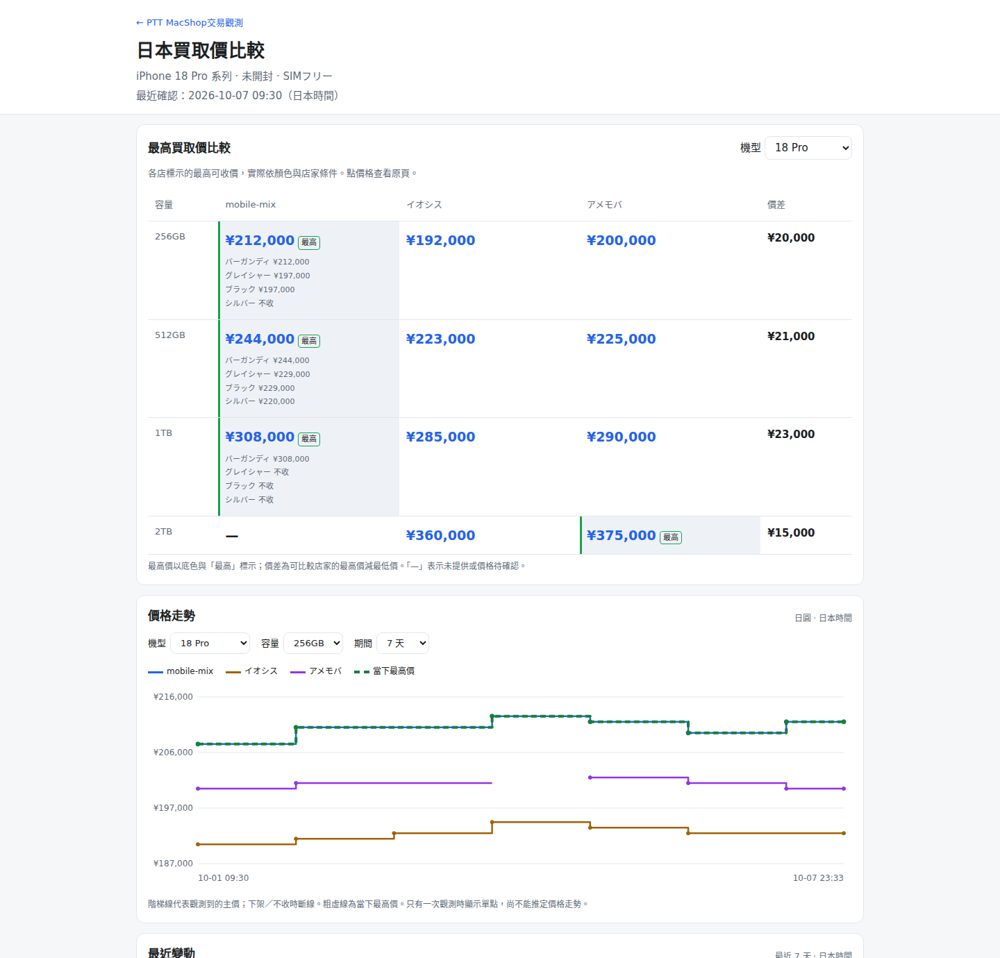
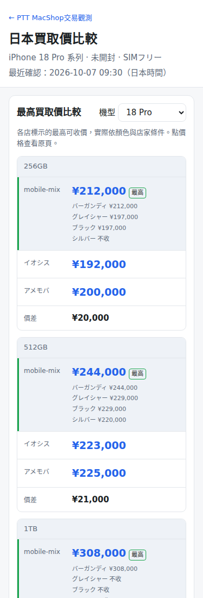
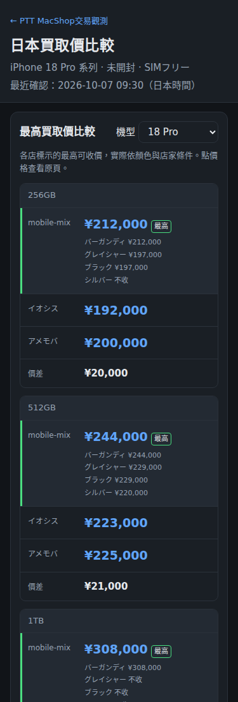
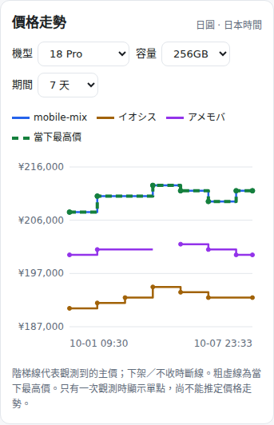
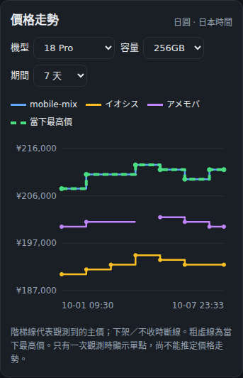

# 日本買取價第一階段驗收與回復（2026-10-07）

本次只開 PR 供人工覆核，不合併、不推 main、不觸發正式 Pages。`docs/jp-buyback-plan.md` 從 `claude/project-thread-00f7hl` 帶入；實作以本次明確需求優先（最近 7 天變動、中古／電信版第二階段顯示、PR 不含任何 `data/`）。

## 回復點與撤退方式

- 開始時 main：`8d2a8c2c5be8e3a338a5619a47cbd88ab0c6612a`。功能分支：`codex/jp-buyback-phase1`。
- 原始 HTML 擷取檢查點：`19807d596c8f615aea6b1f58ce1c68a8ed5756c9`。
- 爬蟲完成、雲端 dry-run 檢查點：`845fe73c32b1ce87cd1518386f7699589d8d0c51`。此階段只寫功能分支，暫時 workflow 的 `permissions` 僅 `contents: read`。
- **尚未合併時撤退**：關閉本 PR 即可；正式網站和台灣排程不受影響。若要重做，另從上述 main 基準開新分支，勿 reset／force-push main。
- **人工合併後若需撤退**：先由維護者停用 `jp.yml`（例如 `gh workflow disable jp.yml`），再從當時最新 main 開修復分支，revert 本 PR 的合併 commit（merge commit 用 `git revert -m 1 <merge-sha>`；squash commit 用 `git revert <squash-sha>`），另開 PR 覆核。不要回退整個 main 到舊日期，避免覆蓋台灣排程後續產生的資料。保留既有 `data/jp/` 歷史作為復原證據，不刪除 CSV。
- **恢復點**：問題修復合併後再啟用 `jp.yml`，以 `workflow_dispatch` 抓一次並檢查 `runs.csv`。`prices.csv` 保留歷史；`latest.csv` 對未變價保留 `since`，下架後重新出現則從本次起算。

## 真實來源與爬蟲驗收

- HTML 擷取：[Actions 37635385400](https://github.com/iPliny/ptt-iphone-tracker/actions/runs/37635385400)，五頁全部 HTTP 200。每次依序 curl_cffi chrome，不使用代理或驗證繞過。
- 實際爬蟲：[Actions 37637981702](https://github.com/iPliny/ptt-iphone-tracker/actions/runs/37637981702)，2026-10-07 23:35–23:36 日本時間執行 `python jp/buyback.py --dry-run`。只印 JSON／價格摘要，並驗證 `git diff --exit-code -- data/` 與 `test ! -d data/jp`；未建立或 commit 任何資料。
- 暫時 push 觸發的 `.github/workflows/jp-inspect.yml` 已在最終分支移除；正式 `jp.yml` 無 push 觸發，且 job 只允許 `refs/heads/main` 執行，避免在 PR 分支手動執行時推 main。

| 店家 | 結果 | 解析筆數 | 店家更新日 |
|---|---|---:|---|
| mobile-mix | ok | 26 | 2026-10-07 |
| イオシス | ok | 80 | 未標示，留空 |
| アメモバ | ok | 80 | 2026-10-05 |

筆數包含主價、mobile-mix 精確色價、未開封／中古上限及各版本。後兩家實際各有五版本（包含 Rakuten）、兩機型、四容量、兩狀態，因此各 80 筆。

以下為此次**真實抓取**的未開封・SIMフリー・主價，全部日圓：

| 機型 | 容量 | mobile-mix | イオシス | アメモバ |
|---|---|---:|---:|---:|
| iPhone 18 Pro | 256GB | ¥212,000 | ¥192,000 | ¥200,000 |
| iPhone 18 Pro | 512GB | ¥244,000 | ¥223,000 | ¥225,000 |
| iPhone 18 Pro | 1TB | ¥308,000 | ¥285,000 | ¥290,000 |
| iPhone 18 Pro | 2TB | — | ¥360,000 | ¥375,000 |
| iPhone 18 Pro Max | 256GB | ¥245,000 | ¥210,000 | ¥228,000 |
| iPhone 18 Pro Max | 512GB | ¥279,000 | ¥240,000 | ¥260,000 |
| iPhone 18 Pro Max | 1TB | ¥341,000 | ¥300,000 | ¥325,000 |
| iPhone 18 Pro Max | 2TB | — | ¥380,000 | ¥390,000 |

兩個 Pro Max 推測網址均正確，200 且實際商品名為 `iPhone 18 Pro Max`；イオシス Pro 頁也有對應系列連結：

- https://k-tai-iosys.com/pricelist/smartphone/iphone/iphone18-pro-max/
- https://amemoba.com/smartphone/iphone/iphone-18pro-max/

mobile-mix Pro 256GB 銀色不收；Pro 1TB 只收バーガンディ。未產生被拒收顏色的價格列。頁面用同機型其他容量／歷史已見色名與目前可收色價交叉顯示「不收」；主價仍代表店家標示的最高條件價。

## 離線與瀏覽器驗證

- `python -m unittest`：138 項全過（包含原有 PTT、週報、歷代官方價測試）。
- `node --test tests/*.test.cjs`：49 項全過。
- 涵蓋 parser、色價與不收、同價／改價／下架／恢復、減半與 0 筆防呆、單店失敗隔離、重試與 5／60 秒間隔、時區、缺檔／空檔建置、CSV 下載、異常價、7 日時間窗、斷線與期間前價格延續。
- 本機 Chromium：桌機、375px 淺色與深色、兩機型、2TB、7／30／全部期間、缺資料空狀態、首頁入口；頁面 JavaScript 錯誤 0、375px 橫向溢出 0。
- `site/index.html` 只多一個入口。`site/build_site.py` 只多日本建置呼叫與 sitemap 的 `jp/`。日本建置另放 `site/jp_build.py`，不讀台灣 CSV、不改台灣時區。
- `tracker.py`、`.github/workflows/track.yml`、`column.yml`、`site/column.py`、`legacy/`、`data/` 皆不在本 PR 變更清單。

截圖全部來自 **fixture 產生的示意歷史**，不代表真實歷史走勢。示意 CSV 只放 `/tmp/jp-fixture-data/jp/`，建置輸出 `/tmp/site/`，不納入 PR。



| 375px 淺色 | 375px 深色 |
|---|---|
|  |  |
|  |  |


## 重現本機截圖

```sh
python -m unittest
node --test tests/*.test.cjs
# 用新的暫存目錄；產生器拒絕專案 data/ 與已有 jp/ 的目錄。
python tests/jp_preview.py --data /tmp/jp-fixture-data
python site/build_site.py --out /tmp/site --data /tmp/jp-fixture-data
python site/build_site.py --out /tmp/jp-home-site
# 選用的開發環境依賴，不加入正式網站／爬蟲套件。
python -m pip install playwright==1.56.0
python -m playwright install chromium
# 本機需有 CJK 字型，例如 Noto Sans CJK TC。
python tests/jp_browser_check.py --site /tmp/site --home-site /tmp/jp-home-site --screenshots /tmp/jp-screenshots
```

`jp_browser_check.py` 用本機 route 提供檔案並阻擋所有外站請求（含 GA），驗收本身離線；正式頁面保留與既有頁面完全相同的 GA inline 官方碼。
